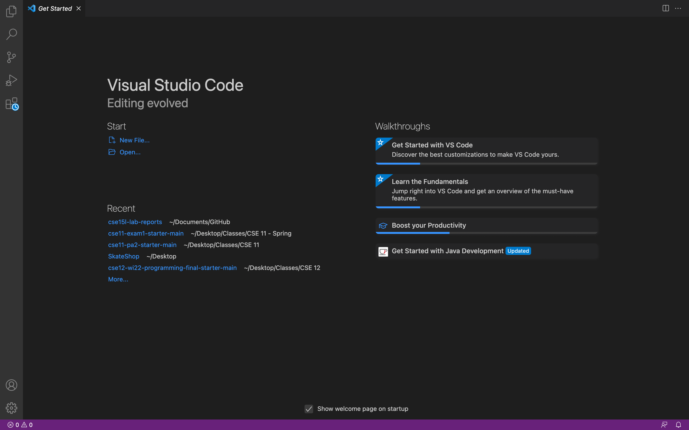
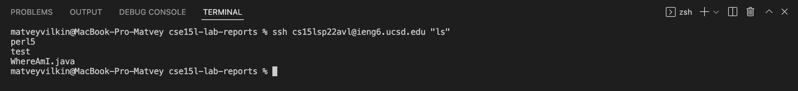

# Week 2 Lab Report


## Installing VScode

We first need to download an IDE which will allow us to comfortably manage files and code. We will install VS Code, following the instrcutions below:

1. Go to [https://code.visualstudio.com](https://code.visualstudio.com/).
2. Download the Visual Studio Code IDE. The download button will usually allow you to download the version of the app for your specfic OS automatically. 
3. Once installed correctly you should be able to open VS Code like below: 


## Remotely Connecting

Proceeding to connecting to a remote computer, we need to execute the fllowing steps:

1. If you're using Windows - install OpenSSH following the instructions [here](https://docs.microsoft.com/en-us/windows-server/administration/openssh/openssh_install_firstuse).
2. Look up your course-specific account for CSE15L [here](https://sdacs.ucsd.edu/~icc/index.php).
3. Open a terminal in VSCode and type the following command: `$ ssh cs15lsp22zz@ieng6.ucsd.edu` substituting the `zz` with your specific code. You will then be asked to input your password.
4. Upon succesful log in you should see the following: 

## Trying Some Commands

1. Now that you have logged in you should try some commands. Use any of the following:
    - `cd <directory>` - naviagtes to the given directory.
    - `ls` - lists all of the files in the current directory.
    - `pwd` - shows current path.
    - `mkdir <directory>` - creates directory with given name.
2. Below you can see an example:

3. To log out of the remote server you can always use the `exit`.

## Moving Files with scp

It is now always enough to be able to run commands on the remote server. Often times we will also want to be able to send files to the remote server from our local computer.

1. To move files from your local computer to a server you can use the following command `scp <filename> <server path>`
2. As an example - moving a file named `WhereAmI.java` (from the directory where it is located) to my server would look like the following:

3. To ensure that the file was tranferred correctly you can again log into the remote server and use the `ls` command to see all the files.

## Setting an SSH Key

Instead of having to log in with your password everytime, you can create a pair of files called public and private keys and use those to make make the process of log in much easier.

To do so, you can follow the instruction below:

1. On your local computer (the client), run the following command - `ssh-keygen` - this command generates a public/private key pair. 
2. We now need to create a `.ssh` directory on the server and copy the public key onto there. Execute the following commands:
```
terminal
$ ssh cs15lsp22avl@ieng6.ucsd.edu
<Enter Password>
# now on server
$ mkdir .ssh
$ <logout>
# back on client
$ scp /Users/evank/.ssh/id_rsa.pub cs15lsp22avl@ieng6.ucsd.edu:~/.ssh/authorized_keys
```
3. Now you should be able to log in without having to input the passsword like below: 

## Optimizing Remote Running

To further make remote running easier we can do the following:

1. You can make remote running even more seamless by using command lines within quotation marks to run commands on the server in the same ssh session. For example:


2. You can also run multiple commands at once, separating them with a `;`. Look at the example below:

```
scp WhereAmI.java OtherMain.java; javac OtherMain.java;
java WhereAmI
```
