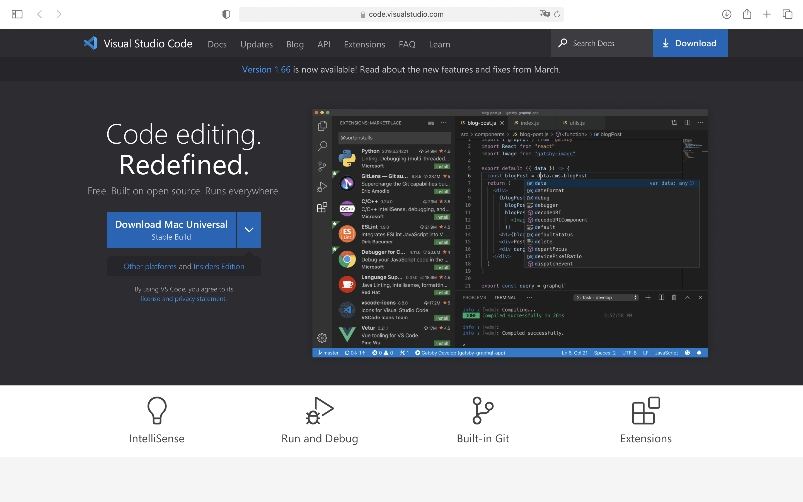
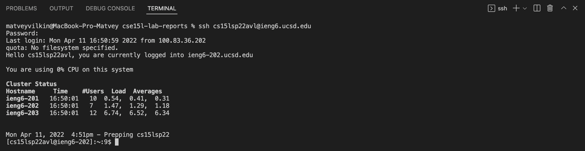
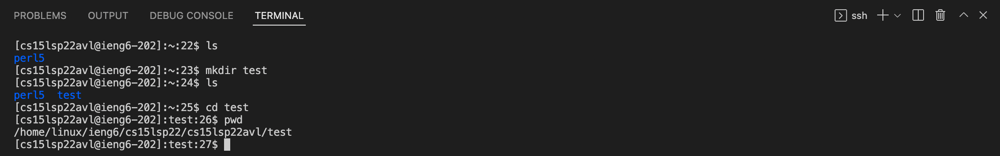
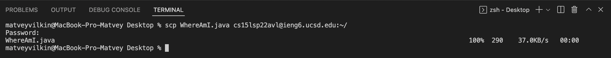
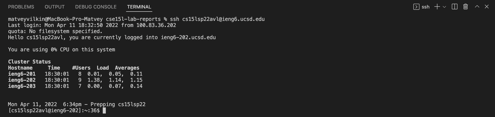

# Week 2 Lab Report


## Installing VScode

1. Go to https://code.visualstudio.com/
2. Download the IDE. The download button will usually allow you to download the version of the app for your specfic OS. 
3. 

## Remotely Connecting

1. If you're using Windows - install OpenSSH following the instructions [here](https://docs.microsoft.com/en-us/windows-server/administration/openssh/openssh_install_firstuse).
2. Look up your course-specific account for CSE15L [here](https://sdacs.ucsd.edu/~icc/index.php).
3. Open a terminal in VSCode and type the following command: `$ ssh cs15lsp22zz@ieng6.ucsd.edu` substituting the `zz` with your specific code. You will then be asked to input your password.
4. Upon succesful log in you should see the following: 

## Trying Some Commands

1. Now that yoy have logged in you should try some commands. Use any of the following:
    - `cd <directory>` - naviagtes to the given directory.
    - `ls` - lists all of the files in the current directory.
    - `pwd` - shows current path.
    - `mkdir <directory>` - creates directory with given name.
2. Below you can see an example:


## Moving Files with scp

1. To move files from your local compyter to a server you can use the following command `scp <filename> <server path>`
2. As an example - moving a file named `WhereAmI.java` to my server would look like the following:


## Setting an SSH Key

1. On your local computer (the client), run the following command - `ssh-keygen` - this command generates a public/private key pair. 
2. We now need to create a `.ssh` directory on the server and copy the public key onto there. Execute the following commands:
```terminal
$ ssh cs15lsp22avl@ieng6.ucsd.edu
<Enter Password>
# now on server
$ mkdir .ssh
$ <logout>
# back on client
$ scp /Users/evank/.ssh/id_rsa.pub cs15lsp22avl@ieng6.ucsd.edu:~/.ssh/authorized_keys
```
3. Now you should be ablw to log in without giving the passsword like below: 

## Optimizing Remote Running

1. You can make remote running even more seamless by using command lines within quotation marks to run commands on the server in the same ssh session. For example:

2. You can also run multiple commands at once, separating them with a `;`. Look at the example below:

```
scp WhereAmI.java OtherMain.java; javac OtherMain.java;
java WhereAmI
```
