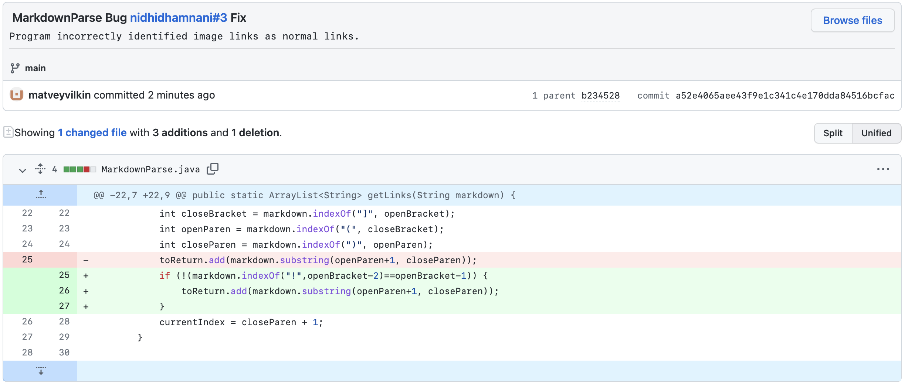
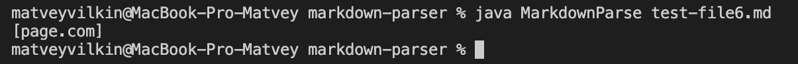

# Week 4 Lab Report

## Code Change 1
1. Screenhsot: 
2. You can see the file that was the failure-inducing input here: [test-file2.md](https://github.com/matveyvilkin/markdown-parser/blob/3bf95f8c828f6e0b47d5a126c1ecc32bef576f2d/test-file2.md)
3. Symptom: 
4. Explanation: The failure-inducing file contained a line after the last link. This made the while loop never end and links were added to the `toReturn` ArrayList until it run of out heap space, hence the error shown above. To fix this I added the following code block at the start of the while loop:
    ```java
    if (markdown.indexOf("[", currentIndex)==-1){
        break;
    }
    ```
    This ensured that when the last link was found, if there weren't nay more links after that (even if there was still text), the program wouldn't run infinitely.

## Code Change 2
1. Screenhsot: 
2. You can see the file that was the failure-inducing input here: [test-file3.md](https://github.com/matveyvilkin/markdown-parser/blob/72d37a323693eee7350765d1d1bd369c2c382428/test-file3.md)
3. Symptom: 
4. Explanation: Altough start of the link, namely `[]` was present, there was nothing else, so no closing parenthesis: `()`. Nonetheless the program still looked for them resulting in the error above.
    ``` java
    if (markdown.indexOf("[", currentIndex)==-1 || 
            markdown.indexOf("]", currentIndex)==-1 || 
            markdown.indexOf("(", currentIndex)==-1 || 
            markdown.indexOf(")", currentIndex)==-1 ) {
        break;
    }
    ```
    By updating the `if` statement added in the previous code change, I ensured that the program not only checks for the first `[` before running another itearation, but also for the 3 remaing characters: `]`,`(`,`)`.

## Code Change 3
1. Screenhsot: 
2. You can see the file that was the failure-inducing input here: [test-file6.md](https://github.com/matveyvilkin/markdown-parser/blob/b234528eccd24ee295f8ceb48d8cf3f256916bb1/test-file6.md)
3. Symptom: 
4. Explanation: The program identified image links which are preceeded with a `!` as normal links. As can be seen in the synptom screenshot above, program identified `page.com` as a normal link while it was actually an image link. I added the following code block to check if there is a `!` before the start of the link:
    ```java
    if (!(markdown.indexOf("!",openBracket-2)==openBracket-1)) {
        toReturn.add(markdown.substring(openParen+1, closeParen));
    }
    ```