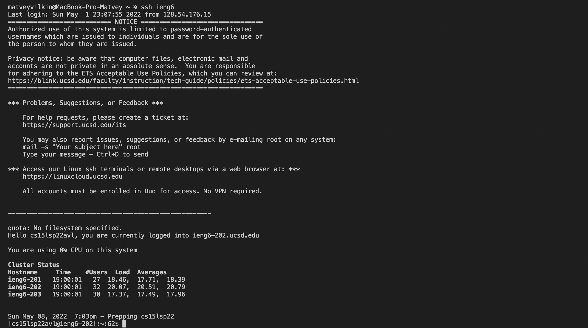
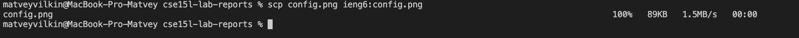
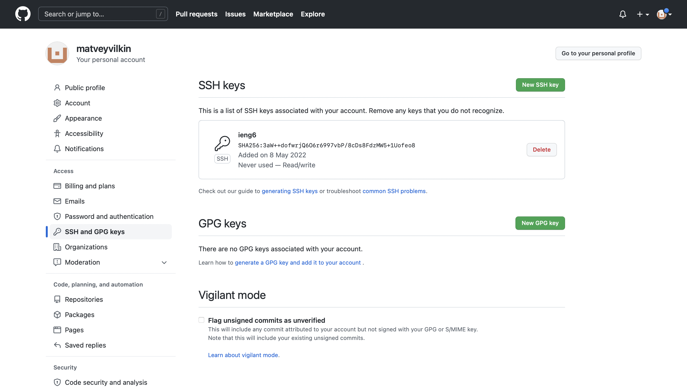
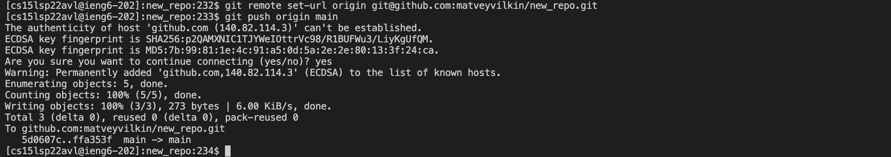
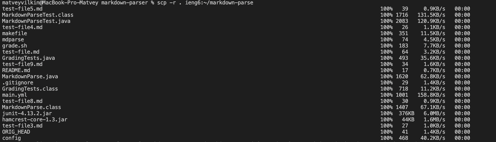
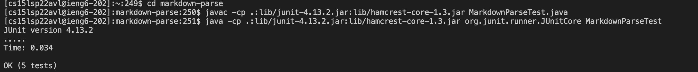
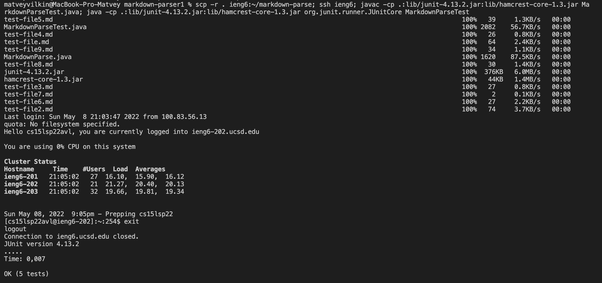

# Week 6 Lab Report

## Streamlining SSH configuration

1. Below you can see my config file: 

2. You can write to your config file from the terminal with the following command (replacing `text` with your information):
    ```
    $ echo "text" > config
    ```

3. I am now able to login only using the alias I indicated (`ieng6`): 

4. As well as that you can use other commands such as `scp` to tranfer a file without indicating the full server adress: 

## Setup Github Access from ieng6

1. I have first generated new public/private key pair on the server. Both of those files were saved in the `.ssh` directory on the server: 

2. I have also uploaded the public key to github: 

3. Here you can see me running the git commands from the server, pushing the changes to Github: 

4. You can see the commit [here](https://github.com/matveyvilkin/new_repo/commit/ffa353fc30c05cd9867199e00b0cc46748703abb).

## Copy whole directories with `scp -r`

1. You can copy a whole directory to a remote server using `scr -r`: 

2. Once I copied the directory with the code I run the tests for the code on the server: 

3. You can also run all these commands together combining them using `;` like below: 