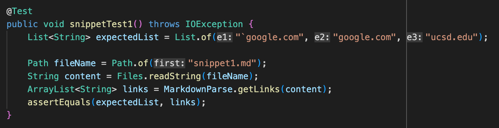
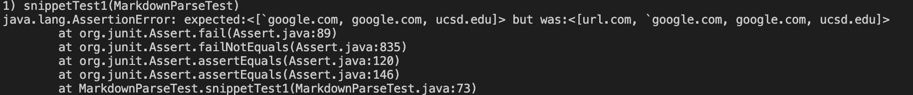
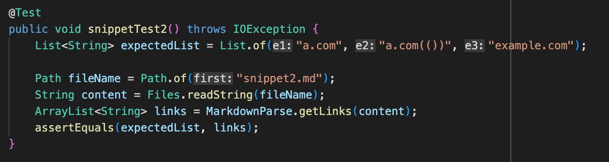
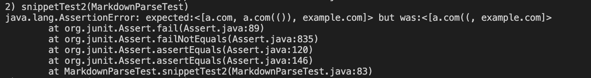
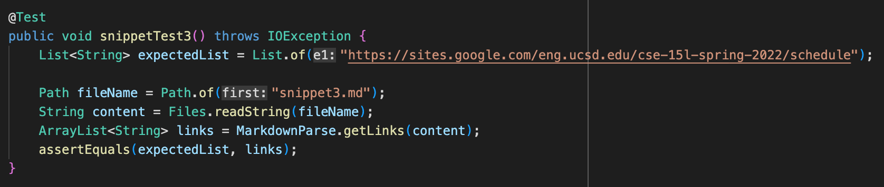
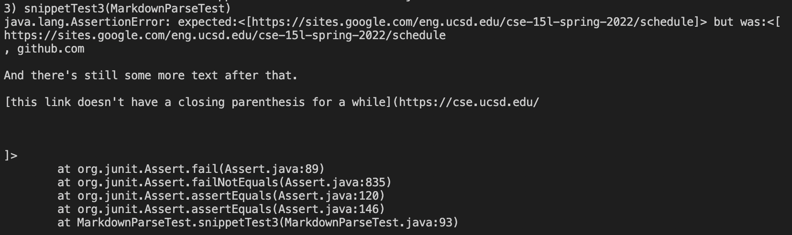

# Week 8 Lab Report

[The Common Mark demo site]() site will be used to determine the outputs of each respective snippet.

You can access my repository [here](https://github.com/matveyvilkin/markdown-parser).

You can access the repository reviewed in week 7 [here](https://github.com/hsflores7/markdown-parser).

## Snippet 1

1. The output of the program when run on this snippet should be: 
    ```
        [`google.com, google.com, ucsd.edu]
    ```
2. Below is the code for the test of snippet 1:
    

3. The output of my implementation produced the following:

    

4. The output of the repo worked on in week 7 produced the follwoing:

    

## Snippet 2

1. The output of the program when run on this snippet should be: 
    ```
        [a.com, a.com(()), example.com]
    ```
2. Below is the code for the test of snippet 1:
    

3. The output of my implementation produced the following:

    

4. The output of the repo worked on in week 7 produced the follwoing:

    

## Snippet 3

1. The output of the program when run on this snippet should be: 
    ```
        [https://sites.google.com/eng.ucsd.edu/cse-15l-spring-2022/schedule]
    ```
2. Below is the code for the test of snippet 1:
    

3. The output of my implementation produced the following:

    

4. The output of the repo worked on in week 7 produced the follwoing:

    

## Questions

1. Do you think there is a small (<10 lines) code change that will make your program work for snippet 1 and all related cases that use inline code with backticks? If yes, describe the code change. If not, describe why it would be a more involved change.

    ANSWER 1

2. Do you think there is a small (<10 lines) code change that will make your program work for snippet 2 and all related cases that nest parentheses, brackets, and escaped brackets? If yes, describe the code change. If not, describe why it would be a more involved change.

    ANSWER 2

3. Do you think there is a small (<10 lines) code change that will make your program work for snippet 3 and all related cases that have newlines in brackets and parentheses? If yes, describe the code change. If not, describe why it would be a more involved change.

    ANSWER 3
