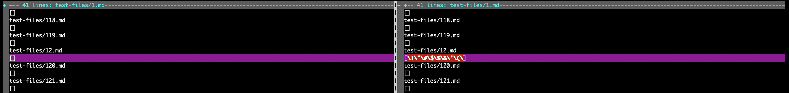
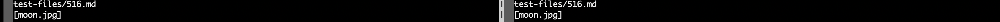

# Week 10 Lab Report

I found these bug using vimdiff and comparing the outputs of the two implementations, and then inspecting the file and using the VSCode preview function to determine what the correct output should be.

## Bug #1

1. The test file causing the incorrect output can be found here - [12.md](https://github.com/nidhidhamnani/markdown-parser/blob/8dd87e6914ae40a4321aac8e2483e349de40b03c/test-files/12.md).
2. In this case, my implementation gives incorrect output as there are no actual links in the markdown file.
3. The output from my implemenation (on the right) as well as the implementation provided (on the left) can be seen below:
    
5. The actual output should be (as determined by the [CommonMarkdown Demo site](https://spec.commonmark.org/dingus/)):
    ```
    []
    ```
6. Explanation 

## Bug #2

1. The test file causing the incorrect output can be found here - [530.md](https://github.com/nidhidhamnani/markdown-parser/blob/8dd87e6914ae40a4321aac8e2483e349de40b03c/test-files/530.md).
2. In this case, both implementations are wrong, as they incorrectly identify the link.
3. The output from my implemenation (on the right) as well as the implementation provided (on the left) can be seen below:
    
4. The actual output should be (as determined by the [CommonMarkdown Demo site](https://spec.commonmark.org/dingus/)):
    ```
    [/uri]
    ```
5. Explanation 