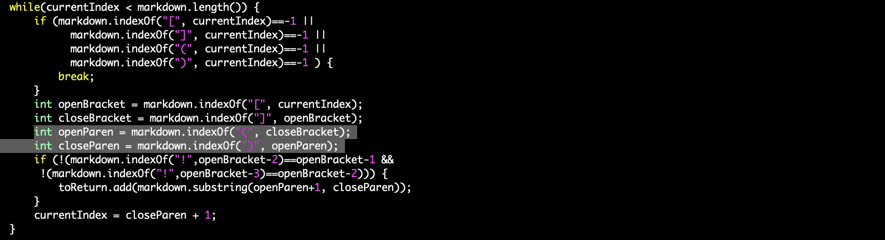
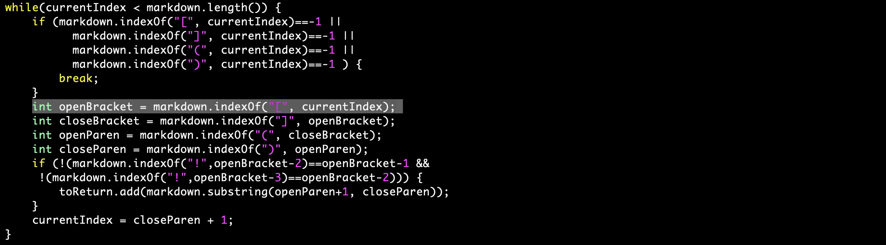

# Week 10 Lab Report

I found these bugs using vimdiff and comparing the outputs of the two implementations, and then inspecting the file and using the VSCode preview function to determine what the correct output should be.

## Bug #1

1. The test file causing the incorrect output can be found here - [12.md](https://github.com/nidhidhamnani/markdown-parser/blob/8dd87e6914ae40a4321aac8e2483e349de40b03c/test-files/12.md).
2. In this case, my implementation gives incorrect output as there are no actual links in the markdown file.
3. The output from my implemenation (on the right) as well as the implementation provided (on the left) can be seen below:
    
5. The actual output should be (as determined by the [CommonMarkdown Demo site](https://spec.commonmark.org/dingus/)):
    ```
    []
    ```
6. In this case the bug is within the body of the while loop of the `getLinks()` method. The problem is that after `closeBracket` index is found, there are no parentheses to be found therefore the `openParen` variable is assigned to -1. Therefore, when `toReturn.add()` is run, the substring is between the indexes 0 and the `closeParen` variable. Therefore a simple if stateent after each index assigment to check whethere it is -1 would solve this issue. If the index is indeed -1 so the character is not present, the loop will break.
    

## Bug #2

1. The test file causing the incorrect output can be found here - [516.md](https://github.com/nidhidhamnani/markdown-parser/blob/8dd87e6914ae40a4321aac8e2483e349de40b03c/test-files/516.md).
2. In this case, both implementations are wrong, as they incorrectly identify the link.
3. The output from my implemenation (on the right) as well as the implementation provided (on the left) can be seen below:
    
4. The actual output should be (as determined by the [CommonMarkdown Demo site](https://spec.commonmark.org/dingus/)):
    ```
    [/uri]
    ```
5. In this case, again, the problem lies within the body of the while loop. Given that there is an image link within the link itself, there is another set of brackets and parentheses within the first brackets. In order to fix this bug we can just have another check after assigning the first `openBracket`, to see whether there is another one present before the `closeBracket`. If so, the next `closeBracket` should be ignored, as well as the set of parentheses `()`.
    